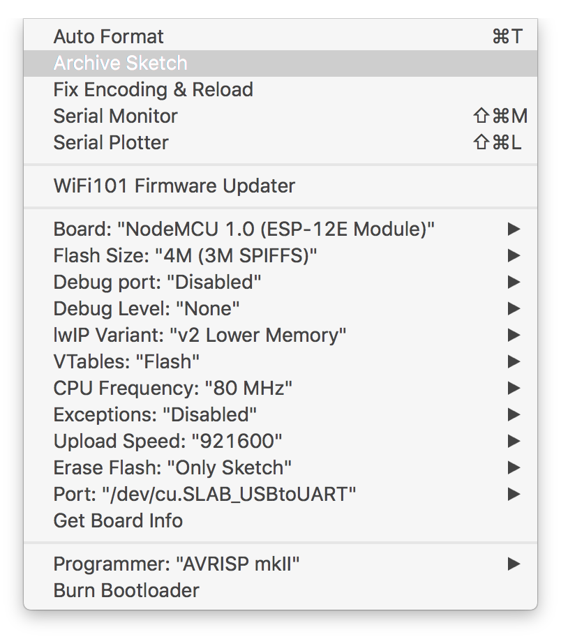

# WARDuino

Warduino is a port of the Web assembly virtual machine for the ESP32/ESP8266 under the arduino toolchain. 

# Overview of the project 

```
├── README.md
├── WARDuino.cpp
├── WARDuino.h
├── library.properties
├── local
│   ├── main.cpp
│   ├── makefile
│   └── warduino
├── mem.c
├── mem.h
├── util.c
└── util.h
```


# ToolChain Installation and Hello World

- Download [Arduino](https://www.arduino.cc/)

- Clone the repository under `$(HOME)/Arduino/libraries`

- Add the `esp8266` driver

  - Add the repository

    - File > Preferences > Settings > Additional board manager URLS:

      ```
      http://arduino.esp8266.com/stable/package_esp8266com_index.json
      ```

    - Or follow the steps at https://github.com/esp8266/Arduino#installing-with-boards-manager

  - Go to Tools->Boards->Boards Manager

    - Search for `esp8266` and install it (version 2.5.0) 

- Restart Arduino 

- Plug in the board and configure the board settings in the boards menu as follows 

  

- Make a new sketch with the following code:

```C
#include <WARDuino.h>


WARDuino wac;

void setup() {
  Serial.begin(115200);

}

void loop() {
  Serial.println(ESP.getFreeHeap());
  int i = wac.run_module();
  Serial.println(i,HEX);
  Serial.println("DONE");

  while(true) {
    delay(5000);
  }
}
```

- Compile and upload the sketch
  - set 115200 boud


## Run WARDuino on host machine

- Install [`binarien`](https://github.com/WebAssembly/binaryen)


## Goals

- IO is moelijk en lastig want je moet dat uit elkaar halen
- De VM laat toe eenvoudig te debuggen en veranderen
- Het gebeuren van de VM is belangrijk, dan kunnen we elke taal daar naar compileren, de bedoeling is om ook die talen makelijk te debuggen
- Gemakelijk fies overschrijven en toevoegen
- plus typesysteem dat de basis typeoperaties safe maakt
- Updates getypeert houden, int->int blijft int->int, anders gaat het niet (bonus: wel als nergens gebruikt)


# LICENCE 

WARDuino (c) by Christophe Scholliers & Robbert Gurdeep Singh 

WARDuino is licensed under a
Creative Commons Attribution-NonCommercial-ShareAlike 4.0 International License.

You should have received a copy of the license along with this
work. If not, see <http://creativecommons.org/licenses/by-nc-sa/4.0/>.
