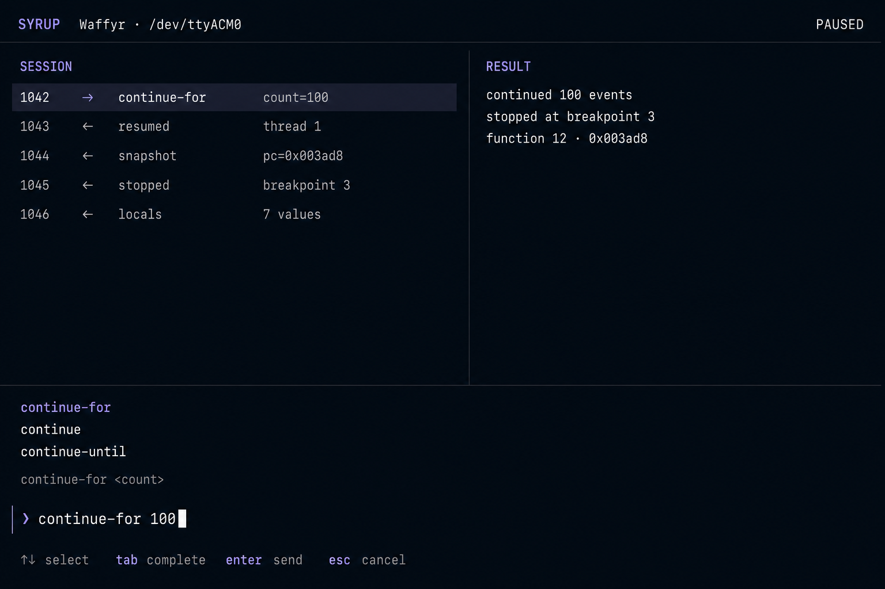

# Console

Run the live console with:

```text
cargo run -p console -- --device localhost:8100
```

`continue` and `pause` are sent through the in-process DAP adapter. The VM
state changes only when the target emits the corresponding event. The Session VM frame column shows every complete outgoing WARDuino frame (discriminator, encoded length, and protobuf payload). Ctrl+C sends
`disconnect`; it detaches while leaving the WARDuino VM running.



